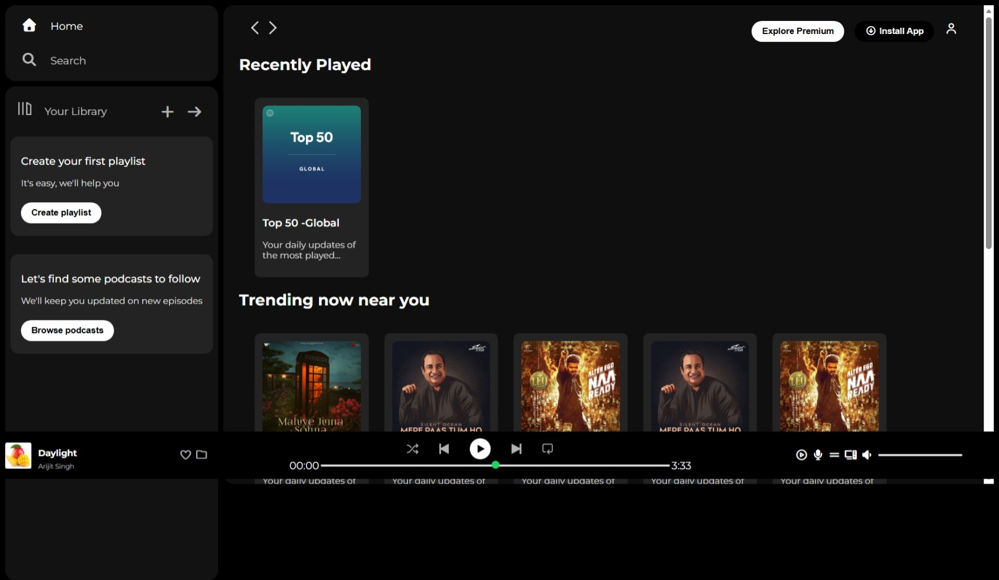

# Spotify Home Page Clone

A static, frontend-only recreation of the Spotify web player home page, built
with HTML and CSS while learning web development. This is a practice project
and is not affiliated with Spotify. Images and branding belong to their owners.

## Live Demo
https://github.com/vanya-18o5/spotify-clone.git

## Built With
HTML, CSS, Font Awesome icons, Google Fonts (Montserrat)

## What I Practiced
- Building the page layout with Flexbox: sidebar, main content area, card
  rows (flex-wrap) and the bottom player bar
- A sticky top navigation bar (`position: sticky`) and a fixed bottom music
  player (`position: fixed`)
- Styling reusable components such as cards, badges and library boxes
- Hover effects using opacity changes
- Custom-styled range sliders for the progress and volume bars
- Using `rem` units and a media query (max-width: 1000px) to hide some
  elements on narrower screens

## Note
This is a static layout with no JavaScript, so the buttons and sliders are
visual only.

## Screenshot
